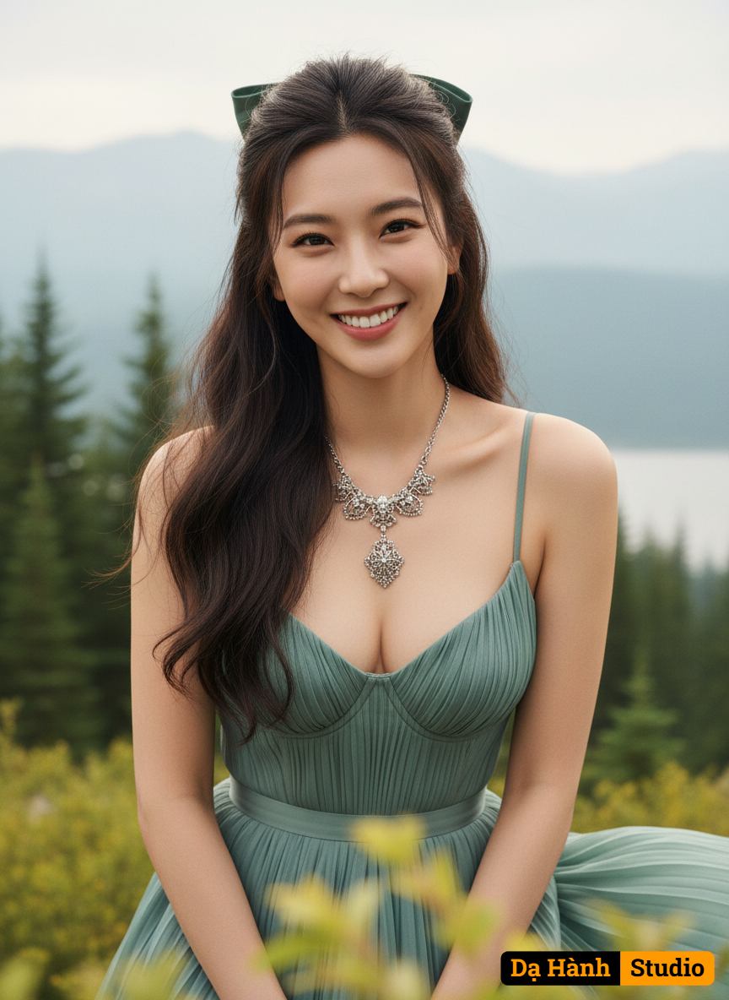

# AI Generated Image

## Details
- **Prompt:** `Ultra photorealistic fashion portrait of the same woman from the reference photo, identity locked (do not alter facial features or glasses)
Subject: A mature woman with long, wavy hair styled in a half-updo with a bow, with strands framing her face.
 She is wearing a necklace with a detailed, possibly ornate, pendant. Her eyes are opened smiling looking directly at the camera
​Background: A natural outdoor setting with a shallow depth of field. In the midground, there are evergreen trees (conifers) and hints of a body of water (lake or river) in the distance. The far background features large, hazy, light-colored mountains under what appears to be an overcast or soft-light sky. The immediate foreground has some blurred green and yellow foliage.
​Camera Angle: A medium shot, slightly from above, looking down at the subject. Her chest and upper body are prominently featured, with the top of her head just below the upper edge of the frame and her waist/hips near the bottom.
​Pose: She is seated or leaning forward, with her head tilted down and slightly to her right (our left). Her shoulders are slightly rounded, creating a somewhat introspective or shy expression. Her arms are down, but their exact position isn't fully visible due to the crop and her attire.
​Outfit: A two-piece outfit consisting of a dark teal or muted green pleated bustier-style top that deeply plunges, Below the bustier, there is a disti The bottom part of the outfit appears to be a matching pleated skirt or flowing fabric in the same muted green/teal color.
​Lighting: Soft, diffused natural light, suggesting an overcast day or late afternoon/early morning. There are no harsh shadows, and the light gently illuminates her face and décolletage.
​Art Style: Photorealistic, with a slight artistic or rendered quality. It has a high level of detail in the subject's features, and clothing textures, while the background is somewhat softened to keep focus on the subject.
​woman in her late 20s with detailed skin texture, a genuine face, and natural lighting 
​A highly detailed, ultra-realistic
​No deformed eyes
​No extra fingers
​No plastic skin
​Avoid excessive smoothness
​No cartoon
​No painting
​No artifacts
​No watermark`
- **Category:** Characters
- **Source Images:**
  - [View Source](https://raw.githubusercontent.com/lenzcomvth/Somethings/main/Models/Female/Female3.jpg)

## Image
