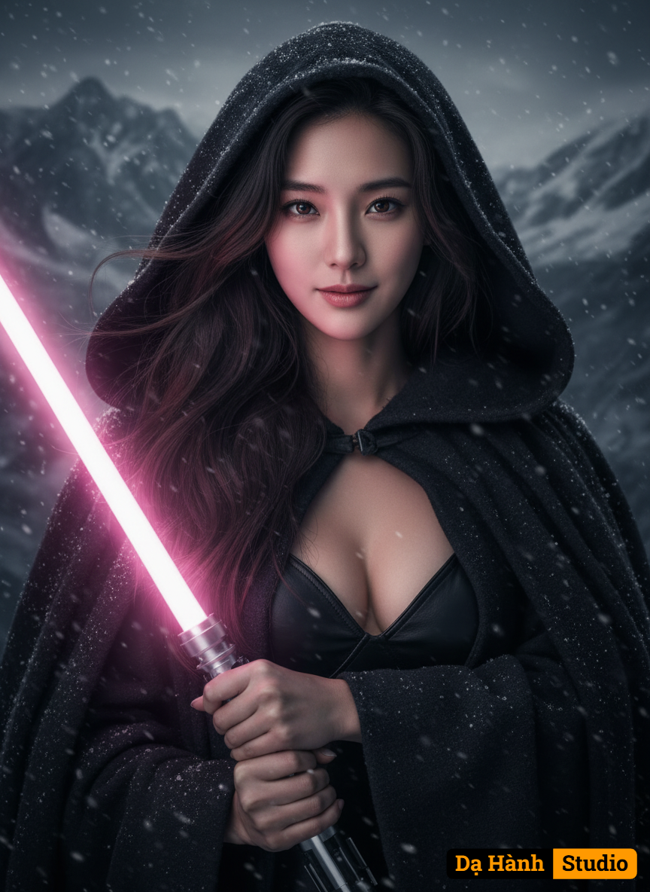

# AI Generated Image

## Details
- **Prompt:** `Ultra photorealistic fashion portrait of the same woman from the reference photo, identity locked (do not alter facial features or glasses)
​Subject: A beautiful young woman with striking eyes and long, wavy hair. She has a serious yet happy and determined expression. She is holding a pink lightsaber with both hands, positioned to her left.
​Background: A dark, snow mountain, suggesting an outdoor, cold environment.
​Camera Angle: A medium close-up shot, focusing on her face and upper torso. Eye-level.
​Pose: She is facing directly forward, looking straight into the camera. Her body is slightly angled, and she is holding the lightsaber up, ready for action.
​Outfit: She is wearing a dark, hooded cloak or robe that partially covers her head and shoulders, with loose strands of hair falling out. Underneath, she appears to be wearing a dark, possibly leather, low-cut top or bralette
​Art Style: Photorealistic
​woman in her late 20s with detailed skin texture, a genuine face, and natural lighting 
​A highly detailed, ultra-realistic
​No deformed eyes
​No extra fingers
​No plastic skin
​Avoid excessive smoothness
​No cartoon
​No painting
​No artifacts
​No watermark`
- **Category:** Characters
- **Source Images:**
  - [View Source](https://raw.githubusercontent.com/lenzcomvth/Somethings/main/Models/Female/Female3.jpg)

## Image
