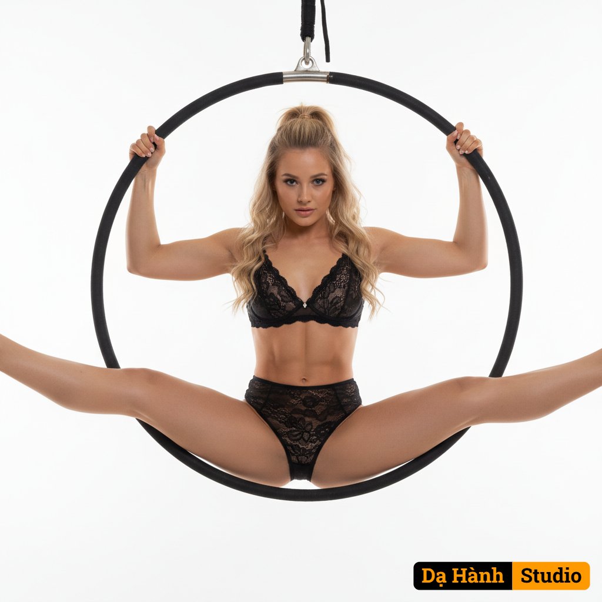

# AI Generated Image

## Details
- **Prompt:** `Subject: A young woman wearing black, one-piece lace lingerie
 with long flowing blonde hair in a ponytail 
​Background: A studio setting with a white backdrop
​Camera Angle: A straight-on, eye-level shot, positioned centrally to capture the subject and the aerial hoop equally.
​Pose: The woman is seated within a black aerial hoop, suspended. She is performing a "straddle" or "open V" aerial pose, with her legs widely split and extended outwards, and her arms gripping the top of the hoop. Her gaze is directed straight at the camera.
​Lighting: The lighting is bright and clean, contrasting with the dark subject matter.
​Art Style: Photorealistic, with a theatrical, reminiscent of alternative fashion photography or a themed photoshoot.
Zoom in close on her body showing her`
- **Category:** Characters

## Image
