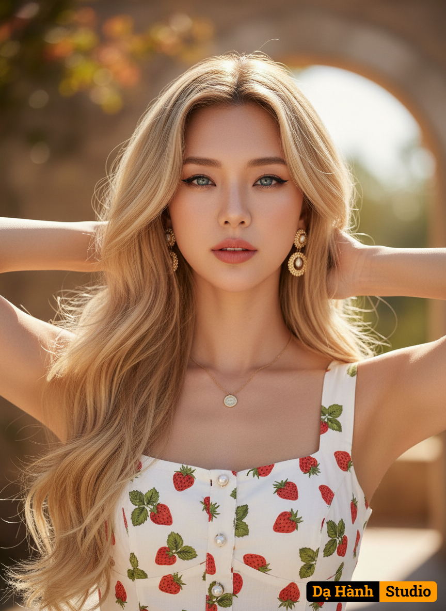

# AI Generated Image

## Details
- **Prompt:** `A captivating vertical portrait features a beautiful woman with long, flowing blonde hair, styled with a center part, and striking blue eyes. The image, likely captured with a prime lens on a camera such as a Nikon Z7, focuses on her upper body, highlighting her elegant features and summery attire. Her gaze is directed towards the viewer, conveying confidence and allure.
Her makeup is expertly applied, emphasizing her eyes with defined brows and subtle eyeliner, while her lips are a soft, peachy-pink. She wears delicate gold jewelry, including a minimalist necklace with a small pendant and ornate circular drop earrings. Her hands are gently placed behind her head, allowing her long hair to cascade around her shoulders. She is dressed in a charming white dress adorned with a vibrant red strawberry and green leaf print, featuring a square neckline and small buttons down the front of the bodice. The background is softly blurred, suggesting an outdoor setting, possibly an architectural element like an archway, which adds depth without distracting from the subject.`
- **Category:** Characters
- **Source Images:**
  - [View Source](https://raw.githubusercontent.com/lenzcomvth/Somethings/main/Models/Female/Female3.jpg)

## Image
