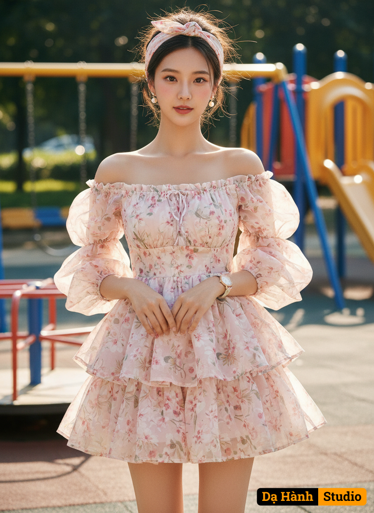

# AI Generated Image

## Details
- **Prompt:** `Create ultra-realistic cinematic glamour image full body 100% copy face upload of young woman wearing
Style: It's a mini dress or babydoll dress with an emphasis on a light, dreamy feel. The overall aesthetic is very feminine, soft, and delicate.
Neckline & Sleeves: It features an off-the-shoulder or bardot neckline with large, sheer, puffy or bishop sleeves—often made of organza or chiffon—which adds to the dramatic, romantic look.
Fabric & Pattern: The main fabric appears to be light and flowy, like chiffon or organza, and it has a delicate, subtle floral print or botanical pattern. The sheer overlay contributes to the ethereal quality.
Skirt: The skirt is short and features tiered ruffles, giving it volume and a playful, bouncy appearance.
Bodice: The bodice looks fitted, sometimes with a corset-like or smocked detail around the waist to cinch the figure.
You could accurately call it a Romantic Floral Off-the-Shoulder Tiered Mini Dress or describe it as a Fairycore Ruffled Babydoll Dress. Half tied hair, doll make up and natural skin. Wear floral headscarf tied. Doll shoes, wear watch cute and earings pearl. Background in the play ground.`
- **Category:** Characters
- **Source Images:**
  - [View Source](https://raw.githubusercontent.com/lenzcomvth/Somethings/main/Models/Female/Female3.jpg)

## Image
