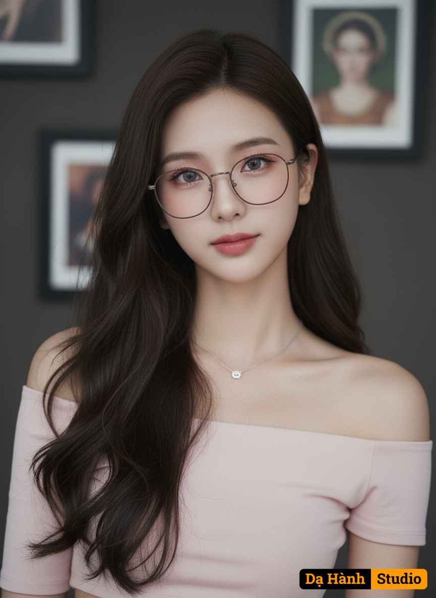

# AI Generated Image

## Details
- **Prompt:** `สร้างภาพ portrait หญิงสาว (บุคคลในรูปภาพที่อัพโหลด) ยังคงใบหน้าให้เหมือนรูปภาพที่อัพโหลดแบบ 100%
ภาพนี้เป็นภาพถ่ายระยะใกล้ของฉันในโทนสีที่ค่อนข้างนุ่มนวลและสลัว (soft and muted).
ลักษณะของบุคคล (Appearance of the Person):
ใบหน้าและท่าทาง: เธอมีใบหน้าเรียวได้รูป ให้ความรู้สึกขี้เล่นหรือเป็นกันเอง ทำท่าทางที่ถ่ายภาพโดยทั่วไป
ทรงผม: ผมยาวเป็นลอนตรงปลายสีดำเข้ม ถูกปล่อยสยายลงมาด้านข้างใบหน้า ไม่มีผมหน้าม้า
แว่นตา: สวมใส่แว่นตาที่มีความเนริ์ด รูปทรงเหลี่ยมมนขนาดกลางซึ่งเป็นแฟชั่นในปัจจุบัน
การแต่งหน้า: การแต่งหน้าเน้นโทนสีชมพูและส้มอ่อนๆ หรือสีลูกพีช (peach) ให้ลุคที่ดูอ่อนเยาว์และใส (innocent/dollish look)
ตา: มีการใช้เงาตา (eyeshadow) สีชมพูอ่อนหรือส้มอมชมพู ทำให้ดวงตาดูโตและหวาน ดวงตาสีอ่อน (อาจเป็นสีเทาอมม่วงหรือสีเทาอ่อน)
แก้ม: ปัดแก้มสีชมพูระเรื่อ
ปาก: ทาลิปสติกสีชมพูเข้มหรือสีชมพูอมแดงที่บริเวณกึ่งกลางปาก ทำให้เกิดเอฟเฟกต์ไล่สี (gradient/ombre lips)
เครื่องแต่งกาย: สวมเสื้อครอปน่ารักๆ เปิดไหล่เข้ารูปสีชมพูอ่อน ไหล่ตกมาหนึ่ง
เธอสวมสร้อยคอขนาดเล็กมีประกายวิ้งๆ
องค์ประกอบและฉากหลัง (Composition and Background):
แสงและโทนสี: แสงในภาพดูนุ่มนวล ไม่สว่างจ้ามากนัก โทนสีโดยรวมเป็นสีกลางๆ (neutrals) เช่น สีเทา สีน้ำตาลอ่อน และสีชมพูอ่อน
ฉากหลัง: ฉากหลังเบลอ (bokeh) แต่สามารถสังเกตเห็นได้ว่าเป็นผนังเรียบๆสีเข้ม มีกรอบรูปและภาพวาดคล้ายเธอเเบบสไตร์โรมัน ซึ่งตัดกับใบหน้าและแว่นตาที่ค่อนข้างสว่าง
โดยรวม: ภาพนี้สื่อถึงสไตล์การถ่ายภาพและแต่งหน้าแบบที่ได้รับความนิยมในเอเชียตะวันออก (เช่น เกาหลีใต้) ที่เน้นความน่ารัก (cute/aegyo), ผิวที่ดูขาวใส, และการแต่งหน้าที่ดูเป็นธรรมชาติแต่เน้นดวงตาและริมฝีปาก
ทำให้เหมือนภาพถ่ายจริงมากที่สุด
ขนาดภาพตามไฟล์แนบ`
- **Category:** Characters
- **Source Images:**
  - [View Source](https://raw.githubusercontent.com/lenzcomvth/Somethings/main/Models/Female/Female3.jpg)

## Image
