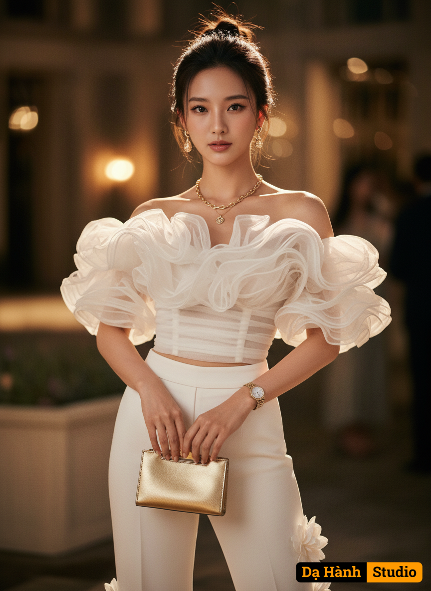

# AI Generated Image

## Details
- **Prompt:** `Create realistic digital cinematic glamour image 100% copy face of young woman wearing a
Off-the-Shoulder/Bardot Neckline: The neckline sits below the shoulders, showcasing the collarbones.
Ruffles/Frills: The main feature is the voluminous, layered ruffles across the chest and shoulders. The fabric looks like a sheer, delicate material such as organza or chiffon, which gives it that airy, puffy texture.
Cropped Fit: It ends above the waistline.
Ruched/Gathered Bodice: The body of the top appears to have some gathering or pleating, which helps create a fitted, structured look on the torso.
This style of top is usually considered formal, cocktail, or evening wear, especially when paired with elegant bottoms like the wide-leg trousers shown in the image.
It can be described as a statement ruffle top or a romantic off-the-shoulder blouse. Wear white flower high heels, doll make and natural skin. Wear elegant necklace, earrings and watch. Messy bun hair style. Wear gold pouch.`
- **Category:** Characters
- **Source Images:**
  - [View Source](https://raw.githubusercontent.com/lenzcomvth/Somethings/main/Models/Female/Female3.jpg)

## Image
