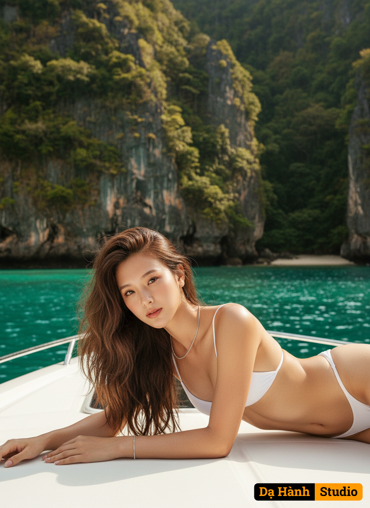

# AI Generated Image

## Details
- **Prompt:** `{
  "concept": "Hyper-realistic cinematic portrait of a stunning Vietnamese woman lying gracefully on a luxury white yacht deck in a tropical paradise — combining elegance, realism, and cinematic aesthetics.",
  
  "character": {
    "ethnicity": "Vietnamese",
    "body": "Slim, toned, and feminine physique with smooth radiant skin that glows under natural sunlight.",
    "face": "Use the exact same face from the uploaded photo — match facial structure, eyes, lips, and expression 100%. Her expression is calm, serene, and naturally elegant.",
    "hair": "Long light purple wavy hair reaching mid-back, glossy and soft under sunlight, with subtle wind-blown motion for natural realism (interpreted as brown tone in current scene lighting).",
    "expression": "Relaxed, elegant, with soft natural confidence and warmth.",
    "pose": "Lying gracefully on her side on the yacht deck, one arm bent supporting her upper body, the other relaxed; gaze directed gently toward the camera."
  },
  
  "clothing": {
    "outfit": "Minimal white string bikini.",
    "design": "Elegant, minimalist swimwear that highlights her natural curves; delicate straps and subtle shimmer under sunlight.",
    "style": "Luxury tropical fashion with modern simplicity.",
    "accessories": "Silver necklace and bracelet reflecting soft sunlight."
  },
  
  "setting": {
    "location": "Luxury white yacht deck floating in turquoise tropical sea.",
    "details": "Emerald sea water and tall limestone cliffs covered with lush green tropical vegetation in the background.",
    "lighting_source": "Soft natural sunlight from above and side, late afternoon tone.",
    "atmosphere": "Warm, calm, tropical luxury ambience with cinematic serenity."
  },
  
  "lighting": {
    "type": "Soft natural daylight with cinematic warmth.",
    "direction": "Side-top sunlight illuminating her face and body evenly.",
    "effect": "Creates a gentle golden glow on skin and subtle rim light on hair; natural reflections on white surfaces."
  },
  
  "camera": {
    "angle": "Eye-level cinematic composition.",
    "lens": "85mm f/1.4 prime lens.",
    "depth_of_field": "Shallow DOF with soft bokeh background.",
    "focus": "Tack-sharp focus on the subject’s face and jewelry.",
    "composition": "Centered composition, natural lines of the yacht deck guiding toward the subject."
  },
  
  "style": {
    "art_direction": "High-fashion tropical editorial photography.",
    "visual_quality": "Ultra-sharp, hyper-realistic micro-detail on skin, hair, jewelry, and fabric texture.",
    "aesthetic": "Elegant, sunlit, serene luxury with natural realism.",
    "tones": "Warm cinematic color grading with golden highlights and turquoise sea tones."
  },
  
  "color_palette": {
    "primary": "White, turquoise, emerald green, warm skin tone, silver highlights.",
    "mood": "Luxurious, peaceful, tropical elegance."
  },
  
  "technical": {
    "resolution": "8K ultra-sharp photorealistic quality — every strand of hair and skin texture rendered in stunning detail.",
    "ratio": "9:16 vertical composition.",
    "quality": "True DSLR-level realism, HDR lighting, natural sunlight balance, no artificial effects."
  },
  
  "negative": {
    "exclude": "no blur, no distortion, no fake texture, no unrealistic proportion, no CGI, no deformation, no watermark, no text, no unclear lighting, no overexposure, no underexposure, no cartoonish style, no low detail, no painting texture, no missing limbs, no face deformation."
  },
  
  "artistic_intent": "To capture an elegant, cinematic, and ultra-realistic vision of Vietnamese beauty — gracefully resting on a yacht under tropical sunlight, surrounded by turquoise waters and cliffs, reflecting the calm luxury of nature and high fashion."
}
`
- **Category:** Characters
- **Source Images:**
  - [View Source](https://raw.githubusercontent.com/lenzcomvth/Somethings/main/Models/Female/Female3.jpg)

## Image
