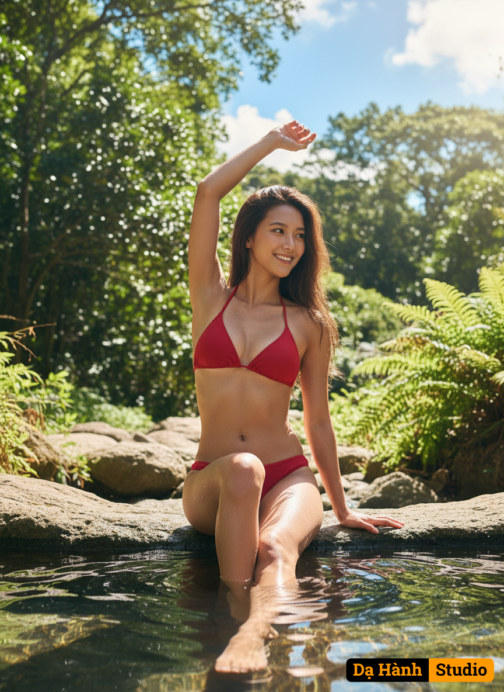

# AI Generated Image

## Details
- **Prompt:** `{
  "concept": "A medium shot of a young woman in a vibrant red bikini, taken from a slightly elevated perspective. She is sitting on the edge of a natural rock pool, with one leg in the water. Her pose is dynamic and graceful, with her torso twisted and one arm arched overhead, looking back towards the sun. The background is a lush, natural environment.",
  "character": {
    "gender": "female",
    "age": "young adult",
    "body": "Natural, athletic build, healthy and vibrant. Tanned skin, glistening slightly from water. Realistic skin textures.",
    "face": "100% real face, natural, radiant expression, with soft, inviting eyes looking over her shoulder towards the light. Genuine smile, natural lip shape.",
    "hair": "Long, dark hair, slightly damp and flowing naturally, with subtle highlights from the sun.",
    "expression": "Cheerful, natural, and relaxed. A sense of joy and freedom. Natural micro-expressions for hyper-realism.",
    "pose": "Sitting on the edge of a natural rock pool. One leg is playfully dipped into the water, creating ripples. Her torso is gently twisted, showcasing her silhouette. One arm is gracefully arched above her head, emphasizing the curve of her body. She is looking over her shoulder towards the sun."
  },
  "clothing": {
    "outfit": "Vibrant red triangle bikini top and matching string bottoms.",
    "material": "Realistic swimsuit fabric, slightly wet, clinging naturally to the body.",
    "style": "Simple, classic bikini, emphasizing the natural form.",
    "accessories": "None."
  },
  "setting": {
    "location": "A natural rock pool.",
    "details": "The rock pool should have realistic water textures, reflections, and natural rock formations. The water is clear and shimmering. The surrounding environment includes lush green trees and a bright blue sky, indicating a sunny outdoor location.",
    "atmosphere": "Warm, cheerful, natural, and inviting. The scene exudes a sense of tranquility and enjoyment."
  },
  "lighting": {
    "type": "Bright daylight, with warm sunlight.",
    "direction": "The sun is positioned to create gentle highlights on her skin and hair, especially as she looks over her shoulder towards it. Natural shadows will fall where appropriate, adding depth.",
    "effect": "Creates a glowing effect on her skin and hair, emphasizing the natural beauty of the scene. Realistic reflections on the water surface and wet skin."
  },
  "camera": {
    "angle": "Medium shot, captured from a slightly elevated perspective (drone shot or high-angle shot).",
    "lens": "Standard prime lens (e.g., 85mm f/1.8) for a natural look and subtle bokeh.",
    "depth_of_field": "Slightly shallow, with the focus on the woman and a gentle blur on the background to enhance her presence.",
    "focus": "Sharp focus on the woman's face and upper body.",
    "composition": "The woman is positioned slightly off-center, utilizing the rule of thirds. The natural lines of the rock pool and her pose guide the viewer's eye through the image. The background elements (trees, sky) provide context without distracting from the subject."
  },
  "style": {
    "art_direction": "Natural, vibrant, and authentic. A lifestyle photograph, capturing a genuine moment.",
    "visual_quality": "Hyper-realistic, photorealistic, with exceptional detail in skin, hair, water, and foliage. No CGI, no cartoonish elements.",
    "aesthetic": "Clean, fresh, and inviting. The scene is naturally beautiful, with a focus on realism.",
    "tones": "Warm and natural color palette, dominated by the red of the bikini, green of the trees, and blue of the sky. Balanced contrast for a vibrant look."
  },
  "color_palette": {
    "primary": "Vibrant red (bikini), lush green (trees), bright blue (sky), natural skin tones, earthy tones (rocks).",
    "mood": "Cheerful, energetic, refreshing, and natural."
  },
  "technical": {
    "resolution": "8K ultra-sharp quality, capturing every detail of the water ripples, skin texture, and foliage.",
    "ratio": "16:9 widescreen or 3:2 standard photographic ratio for a natural landscape feel.",
    "quality": "True DSLR-level realism with natural lens imperfections, subsurface scattering on skin, physical shadows and reflections."
  },
  "negative": {
    "exclude": "tạo hình lỗi, ảnh mờ, không rõ nét, không chân thực; no blur, no distortion, no fake texture, no unrealistic proportion, no CGI, no deformation, no watermark, no text, no unclear lighting, no overexposure, no underexposure, no cartoonish style, no painting texture, no missing limbs, no face deformation, no low detail, no flat rendering, no artificial smoothness, no bad anatomy."
  },
  "artistic_intent": "To capture a moment of natural beauty and joy, highlighting the serenity of the natural environment and the vibrant energy of the young woman. The image should feel authentic and inviting, as if the viewer is present in the scene."
}`
- **Category:** Characters
- **Source Images:**
  - [View Source](https://raw.githubusercontent.com/lenzcomvth/Somethings/main/Models/Female/Female3.jpg)

## Image
