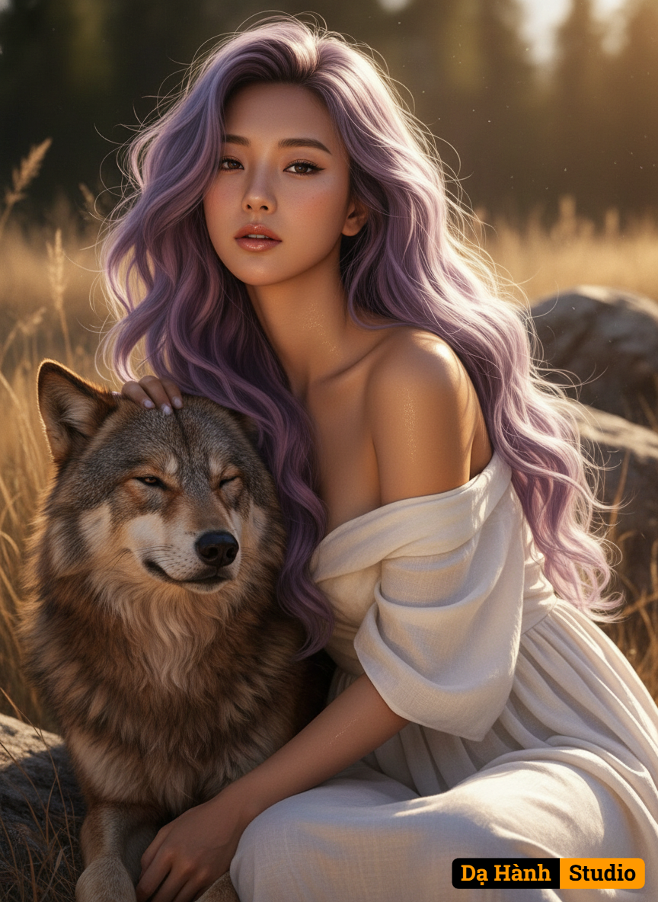

# AI Generated Image

## Details
- **Prompt:** `{
  "version": "Da Hanh Studio v3.4",

  "source_image": {
    "description": "Uploaded reference portrait — real facial features of the subject are preserved precisely.",
    "preserve_identity": true,
    "match_face_100": true,
    "maintain_composition": true,
    "enhancement_goal": "Recreate the real subject’s face within a cinematic 8K photorealistic portrait featuring natural interaction with a wild wolf in sunset lighting."
  },

  "concept": "A romantic, serene, and cinematic close-up portrait of a woman with wavy, slightly messy long hair and a brown fluffy wolf by her side, under warm sunset light and dramatic shadow interplay.",

  "character": {
    "ethnicity": "Asian (default Vietnamese tone).",
    "gender": "female",
    "face": "Use the exact facial structure and expression from the uploaded reference photo — 100% preserved without modification.",
    "hair": "Long light-purple hair extending past the hips, styled in sensual, loose, wavy curls. Strands flow dynamically as if caught in a gentle breeze, shimmering softly under the light — adding motion and realism to the composition.",
    "body": "Close-up framing showing shoulders and arms as she gently pets the wolf’s head with her left hand.",
    "skin": "Natural warm skin tone with sunset glow and visible light reflections; cinematic HDR depth.",
    "expression": "Calm, serene, romantic — slightly parted lips, fox eyeliner, eyes softly focused on camera.",
    "pose": "Leaning slightly toward the wolf, left arm bent to pet its head, body angled slightly toward the light source."
  },

  "animal": {
    "species": "Brown fluffy wolf.",
    "position": "Located on the subject’s left side, partially within the frame.",
    "texture": "Thick fur with visible golden-brown highlights from sunset light; realistic hair fibers.",
    "interaction": "Wolf appears relaxed, eyes half-closed as the woman gently pets its head — emotional bond conveyed."
  },

  "clothing": {
    "outfit": "White flowing dress made of soft linen or silk, naturally draping around shoulders.",
    "material_detail": "Fabric catches golden sunset light and creates subtle reflective glow.",
    "style": "Romantic natural elegance — minimalist, soft, and timeless."
  },

  "setting": {
    "environment": "Wild natural background — dried grass, rocky textures, and hints of forest depth in soft bokeh.",
    "lighting_source": "Strong warm sunset light from front-left direction.",
    "details": "Golden highlights and deep cinematic shadows define texture of skin, fur, and fabric.",
    "atmosphere": "Serene, intimate, and romantic — blending human warmth with wild nature."
  },

  "lighting": {
    "type": "Golden-hour HDR lighting with strong directional shadows.",
    "direction": "Front-left at ~35°, illuminating face and wolf simultaneously.",
    "effect": "Sharp light contrast on contours, warm highlights on face and wolf fur, subtle rim glow on hair strands."
  },

  "camera": {
    "angle": "Eye-level, close-up portrait composition.",
    "lens": "85mm f/1.4 for soft bokeh and cinematic sharpness.",
    "depth_of_field": "Shallow DOF isolating subject and wolf from background, creamy natural blur.",
    "focus": "Sharp focus on eyes and wolf’s head, smooth falloff on shoulders and environment.",
    "composition": "Close framing capturing emotional intimacy and texture interplay between hair, skin, and fur.",
    "render_target": "8K HDR cinematic vertical 3:2 ratio."
  },

  "style": {
    "art_direction": "Cinematic romantic realism — fusion of elegance, nature, and emotional stillness.",
    "visual_quality": "8K HDR ultra-realistic detailing with organic light physics and texture fidelity.",
    "aesthetic": "Warm, nostalgic, serene, dramatic with subtle editorial composition.",
    "tones": "Golden-hour warmth blended with earthy tones of fur and white dress."
  },

  "color_palette": {
    "primary": "Golden amber, lavender hair tone, warm beige skin, white dress, deep brown wolf fur.",
    "mood": "Serene, romantic, warm — symbolizing harmony between nature and humanity."
  },

  "technical": {
    "resolution": "8K HDR photorealistic cinematic output.",
    "ratio": "3:2 vertical portrait.",
    "quality": "Physically Based Rendering (PBR), HDR tone mapping, DSLR optical simulation, true depth and softness."
  },

  "enhancement": {
    "portrait_light_boost": "Amplify sunset warmth and enhance natural glow on skin and hair.",
    "face_detail_refinement": "Sharpen facial contours gently while preserving natural softness.",
    "depth_focus": "Enhance shallow DOF with smooth cinematic blur around subject and wolf.",
    "color_saturation": "Boost golden and lavender tones subtly for realistic vibrancy.",
    "skin_refinement": "Refine texture and microdetails while keeping pore realism.",
    "eye_enhancement": "Slightly brighten and sharpen eyes for captivating focus.",
    "skin_tone_balance": "Ensure even skin tone under warm lighting with soft natural gradient.",
    "hair_enhancement": "Enhance strand separation, depth glow, and flowing motion to mimic wind movement.",
    "vignette": "Add warm cinematic vignette to direct attention toward face and wolf.",
    "contrast_clarity": "Increase midtone contrast and detail precision to emphasize sunlight and shadows."
  },

  "negative": {
    "exclude": "no CGI, no distortion, no overexposure, no artificial blur, no watermark, no text, no cartoon style, no plastic skin, no bad anatomy, no fake fur, no low detail."
  },

  "artistic_intent": "To evoke emotional serenity and cinematic beauty — capturing the harmony of human grace and wild nature in golden light, using the real subject’s face and signature Dạ Hành Studio realism."
}
`
- **Category:** Characters
- **Source Images:**
  - [View Source](https://raw.githubusercontent.com/lenzcomvth/Somethings/main/Models/Female/Female3.jpg)

## Image
