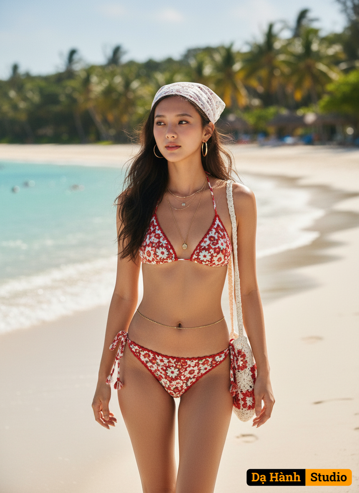

# AI Generated Image

## Details
- **Prompt:** `{
  "version": "Da Hanh Studio v3.4",

  "source_image": {
    "description": "Uploaded reference image of the real woman — her face will be preserved exactly as in the photo.",
    "preserve_identity": true,
    "match_face_100": true,
    "maintain_composition": true,
    "enhancement_goal": "Generate a hyper-realistic full-body portrait in 8K HDR quality, keeping the original face, anatomy, and natural realism while enhancing cinematic color and lighting."
  },

  "concept": "A full-body cinematic fashion portrait of a young woman walking along a tropical beach under bright summer sunlight — exuding confidence, serenity, and bohemian elegance.",

  "character": {
    "ethnicity": "Asian (default Vietnamese tone).",
    "gender": "female",
    "face": "Replicate the exact real face from the uploaded reference — 100% identical structure, expression, and skin detail.",
    "hair": "Long dark wavy hair flowing naturally in the sea breeze, partly covered by a white lace floral bandana. Strands move dynamically as if caught in gentle coastal wind, shimmering softly under the sunlight for natural realism.",
    "body": "Proportional, toned beach figure with natural movement captured mid-step; realistic muscle definition and posture.",
    "skin": "Sun-kissed, smooth, and radiant; realistic specular highlights under tropical light.",
    "expression": "Serene and confident, looking into the distance with calm determination.",
    "pose": "Walking gracefully forward along the shoreline; left hand lightly touching her crochet shoulder bag, right arm relaxed beside body; balanced and natural stride."
  },

  "clothing": {
    "outfit": "Handmade crochet bikini in red and white floral patterns — triangle top and high-waisted bottoms, matched with a crochet shoulder bag.",
    "material_detail": "Fine woven texture with visible yarn fibers and natural stretching under sunlight; highlights emphasize handcrafted detail.",
    "style": "Bohemian summer fashion — stylish, vibrant, yet relaxed.",
    "accessories": "Layered gold necklaces, hoop earrings, and a delicate gold waist chain shimmering in sunlight."
  },

  "setting": {
    "environment": "Tropical beach with turquoise ocean, soft white sand, and bright clear sky stretching to the horizon.",
    "lighting_source": "Natural overhead sunlight during midday summer hour.",
    "details": "Soft breeze creates motion in hair and clothing; subtle sand texture under bare feet; light reflection from sea surface.",
    "atmosphere": "Carefree, cinematic, bohemian — a celebration of summer warmth and freedom."
  },

  "lighting": {
    "type": "Natural HDR daylight with golden summer tone.",
    "direction": "Sunlight from above-front at ~60°, casting soft defined shadows.",
    "effect": "Bright highlights on skin and jewelry, gentle rim light outlining hair and body contours."
  },

  "camera": {
    "angle": "Eye-level full-body portrait, slightly diagonal to suggest movement.",
    "lens": "35mm f/1.8 prime for balanced environment depth.",
    "depth_of_field": "Moderate DOF with crisp subject focus and soft tropical background blur.",
    "focus": "Tack-sharp on the woman’s face and mid-body; gradual falloff toward sand and horizon.",
    "composition": "Vertical 9:16 cinematic framing with subject centered slightly off-axis for natural motion perspective.",
    "render_target": "8K HDR photorealistic full-body vertical composition."
  },

  "style": {
    "art_direction": "Cinematic bohemian summer editorial — blending realism, fashion, and natural light storytelling.",
    "visual_quality": "8K HDR ultra-sharp detail, PBR-based lighting and authentic optical behavior.",
    "aesthetic": "Vibrant, sunlit, and carefree — a mix of natural confidence and editorial polish.",
    "tones": "Warm golden sunlight blended with turquoise, white, and coral color palette for cinematic vibrancy."
  },

  "color_palette": {
    "primary": "Turquoise ocean, coral red, creamy white, golden sunlight, natural tan skin.",
    "mood": "Warm, free-spirited, tropical — elegant yet natural."
  },

  "technical": {
    "resolution": "8K HDR photorealistic rendering.",
    "ratio": "9:16 vertical aspect.",
    "quality": "Physically Based Rendering (PBR), DSLR optical simulation, HDR tone-mapped exposure, cinematic depth."
  },

  "enhancement": {
    "portrait_light_boost": "Increase skin warmth and sunlight glow for authentic beach radiance.",
    "face_detail_refinement": "Sharpen facial features softly while preserving natural smoothness.",
    "depth_focus": "Enhance separation between subject and ocean background for clarity.",
    "color_saturation": "Boost tropical blues and skin warmth moderately for natural vibrancy.",
    "skin_refinement": "Smooth minor blemishes while maintaining natural skin texture.",
    "eye_enhancement": "Brighten eyes subtly for added vitality under sunlight.",
    "skin_tone_balance": "Balance warm and cool tones across the body to avoid color cast from sand or water.",
    "hair_enhancement": "Emphasize strand detail and dynamic motion; add subtle wind flow realism.",
    "vignette": "Apply soft edge vignette to center visual focus on the subject.",
    "contrast_clarity": "Enhance global contrast and clarity for cinematic depth and detail."
  },

  "negative": {
    "exclude": "no blur, no distortion, no cartoon, no fake lighting, no overexposure, no CGI, no watermark, no low detail, no text overlay, no flat shading, no anatomy errors."
  },

  "artistic_intent": "To depict a hyper-realistic cinematic beach portrait radiating summer elegance and natural beauty — capturing bohemian freedom, fashion expression, and emotional warmth in Dạ Hành Studio’s 8K signature style."
}
`
- **Category:** Characters
- **Source Images:**
  - [View Source](https://raw.githubusercontent.com/lenzcomvth/Somethings/main/Models/Female/Female3.jpg)

## Image
