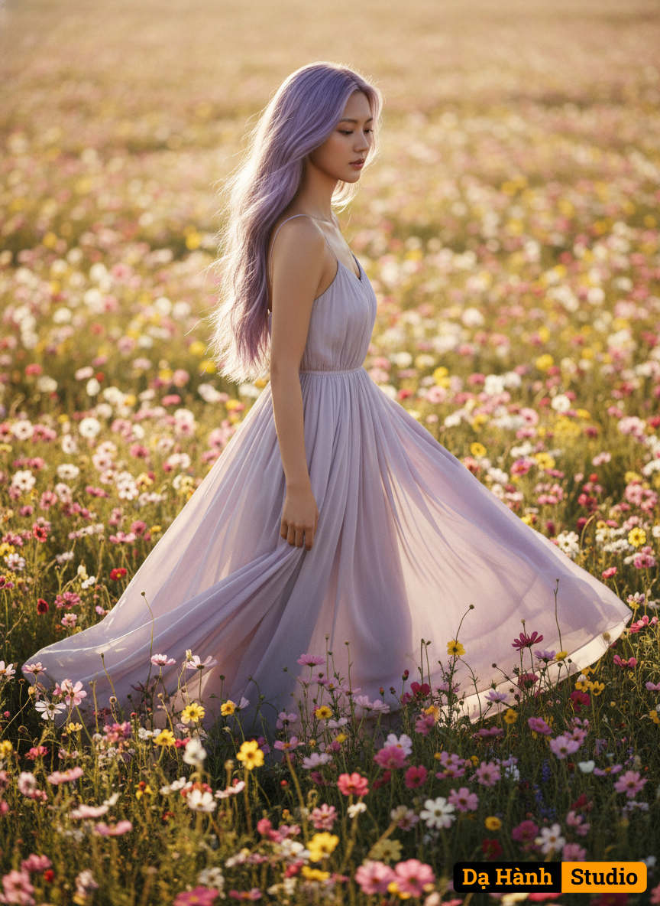

# AI Generated Image

## Details
- **Prompt:** `{
  "version": "Da Hanh Studio v3.3",

  "source_image": {
    "description": "Uploaded reference photo — preserve 100% of the subject’s real face, body proportions, and overall identity.",
    "preserve_identity": true,
    "match_face_100": true,
    "maintain_composition": true,
    "enhancement_goal": "Recreate the person in the uploaded image within a cinematic golden-hour flower field scene at 8K HDR quality, maintaining facial realism, body accuracy, and emotional tone."
  },

  "concept": "An ultra-realistic, cinematic full-body portrait of a woman walking gracefully through an endless field of colorful flowers under the warm golden-hour light — capturing peace, beauty, and emotional depth.",

  "character": {
    "ethnicity": "Asian (default Vietnamese tone).",
    "gender": "female",
    "face": "Exact match to the uploaded photo — maintain 100% facial accuracy, realistic expression, and emotional depth.",
    "hair": "Long light-purple hair extending past the hips, styled in sensual, loose, wavy curls. Strands flow dynamically as if caught in a gentle breeze, shimmering softly under the light — adding motion and realism to the composition.",
    "body": "Preserve original figure and pose proportions; subtle cinematic movement as she walks through the flowers, dress flowing naturally.",
    "skin": "Smooth, radiant, and sun-kissed with natural glow — high-fidelity texture with true-to-life warmth under golden light.",
    "expression": "Soft, serene, and emotionally calm — a sense of inner peace and admiration for nature.",
    "pose": "Walking slowly forward through the field, arms relaxed at her sides or gently brushing against flowers, movement natural and balanced."
  },

  "clothing": {
    "outfit": "Long flowing pastel dress (light pink, lavender, or ivory) made of lightweight, soft fabric that moves gracefully in the breeze.",
    "material_detail": "Visible soft folds and semi-translucent fabric edges catching golden sunlight; realistic texture motion and wind interaction.",
    "style": "Cinematic elegance with gentle romantic tone — minimalist yet ethereal.",
    "accessories": "No jewelry or props other than the dress to keep natural purity of the composition."
  },

  "setting": {
    "environment": "An endless open field of wildflowers stretching to the horizon — filled with pink, purple, yellow, and white blossoms.",
    "lighting_source": "Golden-hour sunlight streaming from one side (~35° elevation) creating soft rim highlights and warm depth.",
    "details": "Soft wind moves flower petals and dress fabric, scattering light in cinematic motion blur; distant background fades into creamy bokeh.",
    "atmosphere": "Peaceful, emotional, and dreamlike — conveying a deep sense of freedom and harmony with nature."
  },

  "lighting": {
    "type": "Natural HDR golden-hour sunlight.",
    "direction": "Sunlight coming from the left-back direction, creating soft rim light on hair and shoulders.",
    "effect": "Warm cinematic glow with realistic shadow depth; gentle volumetric haze enhances atmosphere."
  },

  "camera": {
    "angle": "Eye-level full-body portrait framing.",
    "lens": "85mm f/1.4 prime lens for creamy shallow depth of field and cinematic perspective.",
    "depth_of_field": "Moderate DOF — clear focus on subject, soft falloff on background flowers.",
    "focus": "Sharp focus on face and torso; gradual natural blur toward horizon.",
    "composition": "Centered composition with balance between subject and landscape depth; vertical 9:16 framing for cinematic immersion.",
    "render_target": "8K HDR ultra-photorealistic output."
  },

  "style": {
    "art_direction": "Cinematic fine-art realism merging editorial photography with emotional storytelling.",
    "visual_quality": "8K HDR hyper-detailed textures, balanced exposure, and physically based light reflections.",
    "aesthetic": "Soft, warm, and romantic — highlighting grace and freedom.",
    "tones": "Golden yellows, soft pinks, lavender hues, and light ivory balanced with warm sunlight tones."
  },

  "color_palette": {
    "primary": "Golden sunlight, pastel pink, lavender, ivory, and floral tones.",
    "mood": "Dreamy, natural, romantic — evokes peace, freedom, and elegance."
  },

  "technical": {
    "resolution": "8K HDR cinematic quality.",
    "ratio": "9:16 vertical or 3:2 landscape composition depending on frame use.",
    "quality": "Physically Based Rendering (PBR), HDR tone mapping, volumetric light diffusion, real optical lens simulation."
  },

  "enhancement": {
    "portrait_light_boost": "Add warmth and highlight detail on skin and fabric edges.",
    "face_detail_refinement": "Preserve natural softness with high-definition eye and lip detail.",
    "depth_focus": "Enhance separation between subject and background flowers.",
    "color_saturation": "Slightly boost pastel tones for cinematic harmony.",
    "skin_refinement": "Maintain natural texture with realistic glow; avoid smoothing.",
    "eye_enhancement": "Slight warm reflection to add emotional intensity.",
    "skin_tone_balance": "Blend golden sunlight and natural shadow gradients smoothly.",
    "hair_enhancement": "Add golden light reflections and flowing motion effects.",
    "vignette": "Apply soft warm vignette to center attention on subject.",
    "contrast_clarity": "Increase micro-contrast for HDR depth while maintaining softness."
  },

  "negative": {
    "exclude": "no blur, no distortion, no CGI, no overexposure, no cartoon effect, no flat colors, no watermark, no text overlay, no artificial smoothing."
  },

  "artistic_intent": "To capture a pure cinematic moment of peace and elegance — a woman gracefully walking through a golden-hour field of flowers, expressing serenity and freedom with hyper-realistic detail and emotional depth true to Dạ Hành Studio’s signature realism."
}
`
- **Category:** Characters
- **Source Images:**
  - [View Source](https://raw.githubusercontent.com/lenzcomvth/Somethings/main/Models/Female/Female3.jpg)

## Image
