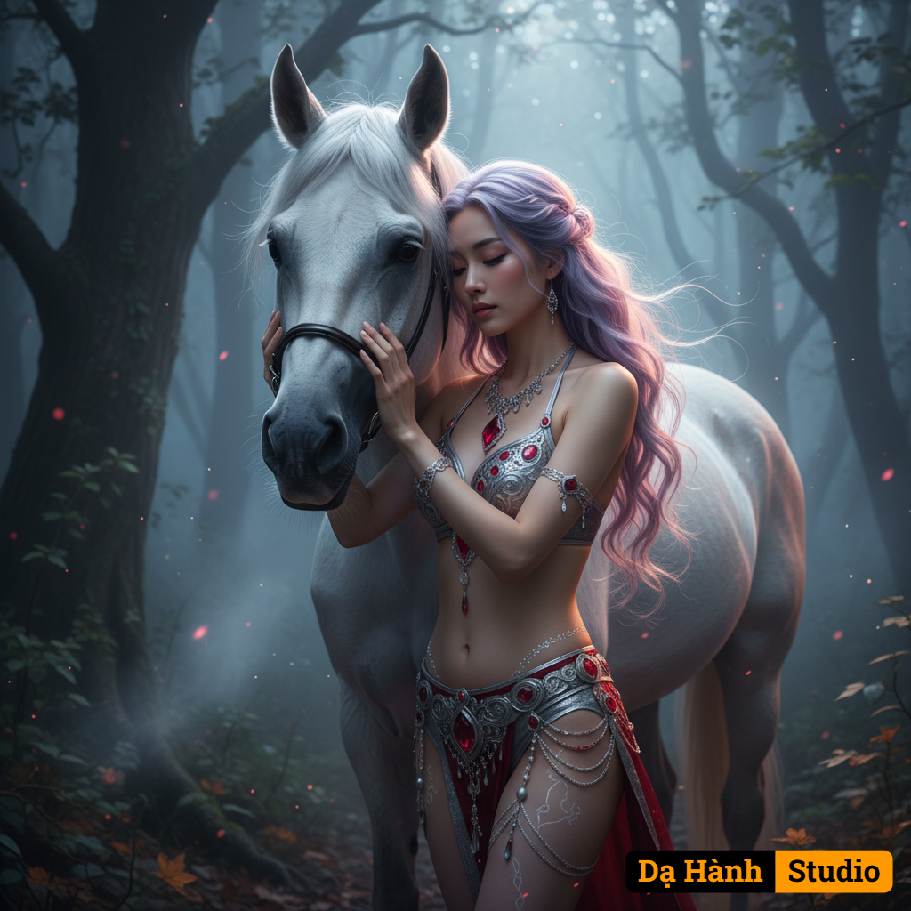

# AI Generated Image

## Details
- **Prompt:** `{"version": "Da Hanh Studio v3.5", "concept": "A hyperrealistic cinematic portrait set in a dark enchanted forest — depicting a powerful young woman and her white Arabian horse illuminated by soft rim lighting and mystical atmospheric glow.", "source_image": {"description": "Prompt-based generation — no uploaded reference image.", "preserve_identity": false, "match_face_100": false, "maintain_composition": true, "enhancement_goal": "Render the scene in cinematic 8K HDR detail with enhanced lighting depth and forest environment integration for a dark-fantasy mood."}, "character": {"ethnicity": "East Asian (Southeast Asian skin tone).", "gender": "female", "age": "early 20s", "face": "Soft symmetrical features, luminous fair skin, and calm determined gaze turned slightly right. Subtle coral lips, clean eyeliner, delicate contouring.", "hair": "Long light-purple wavy hair extending past the back, styled in loose dynamic curls with natural windblown motion, softly glowing under dim rim light.", "body": "Slim, graceful, and poised with natural curves enhanced by cinematic posture.", "skin": "Pale and radiant under low light, with micro-reflections catching subtle warm hues.", "expression": "Serene, confident, yet mysterious — embodying elegance and inner strength.", "pose": "Standing facing the horse, arms gently embracing its neck, forehead touching its mane."}, "clothing": {"outfit": "Intricately embroidered silver and ruby-red two-piece outfit — fantasy-inspired jeweled bra and high-waisted briefs with ornamental hip tassels and glowing threadwork.", "material_detail": "Reflective silver fabric with micro-textured ruby highlights catching the dim light.", "style": "Dark-fantasy couture — elegant, powerful, and visually dramatic.", "accessories": "Silver necklace with large ruby gemstone pendant, ornate bracelets, and faint henna-like designs across abdomen and thighs."}, "setting": {"environment": "Dark enchanted forest at dusk. Mist drifts between ancient trees, faint red fireflies glimmer in the shadows, and soft fog diffuses the background depth.", "lighting_source": "Cold moonlight filtered through branches combined with a warm rim light from front-left, emphasizing contrast between cool background and warm skin tone.", "details": "Wet foliage reflections, scattered light rays through mist, faint particles of glowing dust in air.", "atmosphere": "Cinematic dark-fantasy realism — quiet, powerful, and hauntingly beautiful."}, "lighting": {"type": "Mixed cool–warm HDR cinematic setup (moonlight + soft firelight rim).", "direction": "Main rim from left 45°, secondary blue ambient from right rear, faint volumetric backlight through mist.", "effect": "Enhanced character–background separation, luminous edges on hair and horse, warm highlights on jewelry and ruby details."}, "camera": {"angle": "Medium close-up from the side, focusing on the tender interaction between them.", "lens": "85mm f/1.4 prime lens, cinematic shallow depth of field.", "depth_of_field": "Foreground sharp focus, background forest softly blurred with visible light shafts.", "focus": "Pin-sharp on eyes, jewelry, and horse’s head.", "composition": "16:9 cinematic framing; subjects slightly right of center; leading lines from trees guide toward them.", "render_target": "8K HDR ultra-realistic output with film-grade tone curve."}, "style": {"art_direction": "Dark fantasy cinematic realism blending natural light decay with mystic atmosphere.", "visual_quality": "8K photorealistic rendering with volumetric lighting, global illumination, and true material response.", "aesthetic": "Mysterious, regal, moody — invoking strength and allure through darkness.", "tones": "Balanced interplay of cold blue moonlight, deep ruby reds, silver reflections, and soft golden skin tones."}, "color_palette": {"primary": "Deep charcoal black, forest green, muted silver, ruby red, violet-lavender, moonlight blue.", "mood": "Dark, ethereal, and cinematic — a blend of shadow, elegance, and quiet power."}, "technical": {"resolution": "8K HDR (7680×4320).", "ratio": "16:9 cinematic frame.", "quality": "Physically Based Rendering (PBR), volumetric fog simulation, realistic subsurface scattering, optical vignette depth."}, "enhancement": {"contrast": "Cinematic S-curve enhancement with lifted shadows on subjects, deepened corners for immersion.", "light_balance": "Warm key illumination for skin and jewelry; cool moon fill for environment.", "vignette_effect": "Enhanced soft darkness around frame edges to isolate subjects.", "atmospheric_depth": "Volumetric mist and occlusion layers for true 3D spatial realism.", "texture_detail": "Refined detail pass on embroidery, hair strands, and horse mane.", "color_grading": "Dark-themed cinematic grade — teal–red balance, desaturated shadows, glowing highlights."}, "negative": {"exclude": "no nudity, no blur, no overexposure, no CGI artifacts, no unrealistic body shape, no text overlay, no watermark, no cartoon rendering."}, "artistic_intent": "To express harmony between light and darkness through a powerful feminine presence in a dark enchanted forest — blending fantasy and realism under Dạ Hành Studio’s 8K HDR cinematic aesthetic."}`
- **Category:** Characters

## Image
