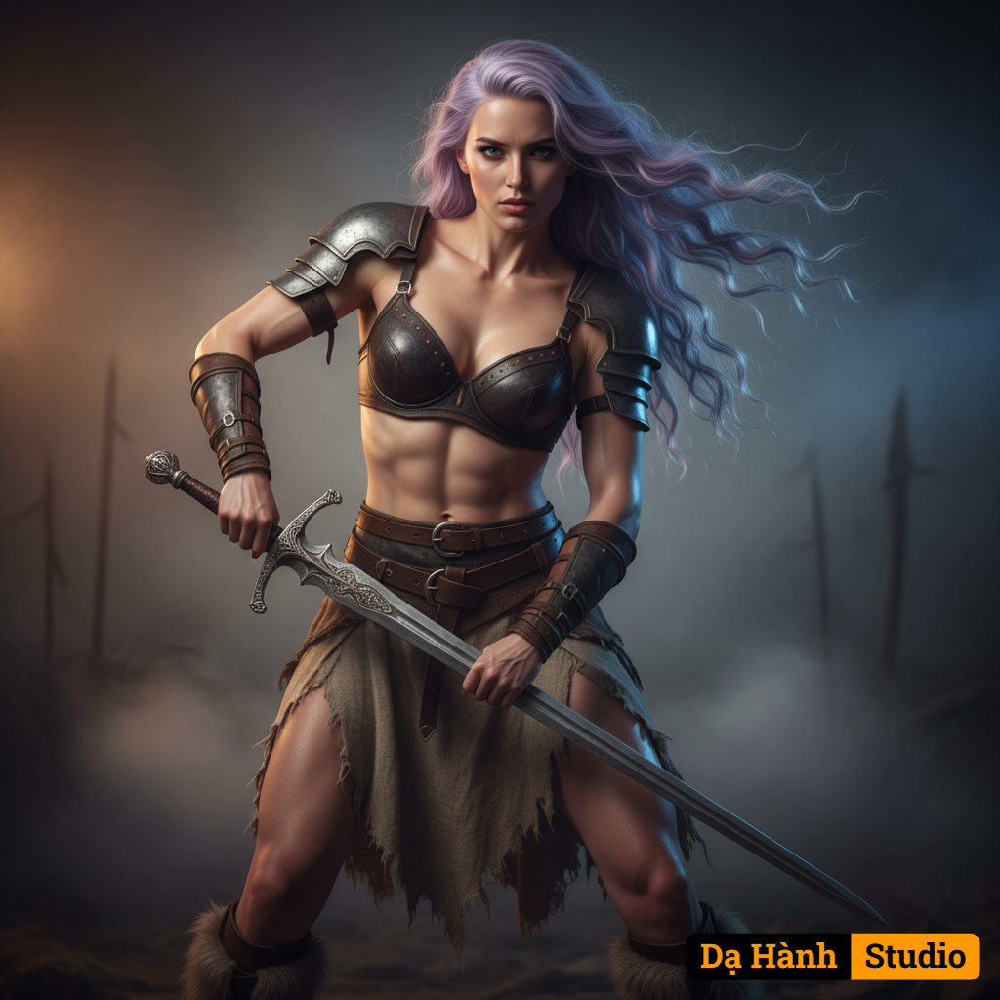

# AI Generated Image

## Details
- **Prompt:** `{
  "version": "Da Hanh Studio v3.6",
  "concept": "A hyperrealistic cinematic portrait of a fierce young female warrior — blending dark fantasy and high realism with tactile materials, expressive emotion, and physical presence.",

  "source_image": {
    "description": "Use the uploaded photo as facial reference — preserve 100% of the original facial features, expression, and structure.",
    "preserve_identity": true,
    "match_face_100": true,
    "maintain_composition": true,
    "enhancement_goal": "Recreate the image in ultra-realistic cinematic 8K HDR quality while keeping face and expression identical to the uploaded photo."
  },

  "character": {
    "ethnicity": "Caucasian (adaptable to uploaded face identity).",
    "gender": "female",
    "age": "mid 20s",
    "face": "100% match with uploaded reference — keep exact bone structure, expression, and gaze intensity. High skin realism with micro-reflections and visible pores.",
    "hair": "Long light-purple wavy hair extending past the back, styled in loose dynamic curls with a natural flowing motion and wind-blown energy, matching cinematic motion lighting.",
    "body": "Strong, athletic, feminine physique with defined abs and muscle tone, realistic skin sheen under directional light. True proportions preserved.",
    "skin": "Smooth but realistic — natural microtexture with visible highlights on collarbone, arms, and abdomen, showing both strength and beauty.",
    "expression": "Fierce and focused, slightly parted lips, eyes locked forward with determination — evoking power and control.",
    "pose": "Dynamic stance with both hands gripping a sword diagonally, body slightly twisted to show strength and motion; upper body tensed, ready for battle."
  },

  "clothing": {
    "outfit": "Fantasy warrior attire — distressed leather bra armor, weathered linen skirt with tattered edges, metallic belt buckles, and fur-lined boots.",
    "material_detail": "PBR materials with visible stitching, rough fabric fiber, aged metal patina, and tactile imperfections.",
    "style": "Dark medieval fantasy armor with realistic weathering and cinematic craftsmanship.",
    "accessories": "Metal shoulder guards, arm wraps, silver belt emblems, and ornate sword handle with embossed design."
  },

  "setting": {
    "environment": "Neutral fantasy studio backdrop resembling misty battlefield atmosphere. Slight ambient haze and smoky gradient background.",
    "lighting_source": "Three-point cinematic studio light setup — warm key light from left, cool rim light from right, soft fill from front.",
    "details": "Subtle mist and volumetric shadows emphasize body contours and sword reflection.",
    "atmosphere": "Epic, heroic, and cinematic — mixing realism with painterly fantasy balance."
  },

  "lighting": {
    "type": "HDR cinematic key lighting with high contrast ratio.",
    "direction": "Primary key from left 45°, rim accent from back right, soft bounce from below to reveal skin microdetails.",
    "effect": "Sharp, dimensional shadows emphasizing physique and armor contours; specular highlights on metal and skin edges."
  },

  "camera": {
    "angle": "Medium full shot, eye-level composition capturing upper body and sword.",
    "lens": "85mm f/1.4 prime lens — high compression, shallow depth of field, cinematic focus.",
    "depth_of_field": "Shallow DOF isolating subject from soft smoky background.",
    "focus": "Pinpoint sharp on eyes, face, and metallic sword detail.",
    "composition": "Centered, dynamic diagonal from sword to face; cinematic symmetry with strong silhouette lighting.",
    "render_target": "8K HDR ultra-sharp photorealistic quality."
  },

  "style": {
    "art_direction": "Cinematic fantasy realism — blending softness of human beauty with power of battle imagery.",
    "visual_quality": "8K HDR PBR rendering, ultra-detailed textures on skin, armor, and hair with photoreal specular response.",
    "aesthetic": "Heroic, raw, elegant — merging realism, light intensity, and emotional depth.",
    "tones": "Warm skin tones, neutral midtones, dark bronze metals, soft smoky grays."
  },

  "color_palette": {
    "primary": "Warm bronze, weathered leather brown, pale silver metal, lavender hair tones, natural skin highlights.",
    "mood": "Epic realism — grounded, powerful, and elegant under cinematic contrast."
  },

  "technical": {
    "resolution": "8K ultra-sharp HDR realism (7680x4320).",
    "ratio": "3:2 portrait composition.",
    "quality": "Physically Based Rendering (PBR), realistic global illumination, volumetric shadow, true lens bokeh."
  },

  "enhancement": {
    "contrast": "Balanced cinematic S-curve for sculpted highlights and shadow depth.",
    "light_balance": "Directional warm–cool contrast maintaining realism across materials.",
    "specular_boost": "Localized reflections on muscles, sword metal, and hair strands for physical accuracy.",
    "micro_detail": "Fine-level noise map on fabric, skin, and metal for realism under 8K lens simulation.",
    "vignette_effect": "Subtle peripheral darkening to increase focus on face and weapon."
  },

  "negative": {
    "exclude": "no nudity, no blur, no CGI artifacts, no plastic skin, no cartoonish tone, no watermark, no text, no distorted anatomy, no fantasy glow effects."
  },

  "artistic_intent": "To convey strength, beauty, and realism through cinematic fantasy — capturing the essence of a modern-day Valkyrie rendered in Dạ Hành Studio’s ultra-realistic 8K HDR style."
}
`
- **Category:** Characters

## Image
