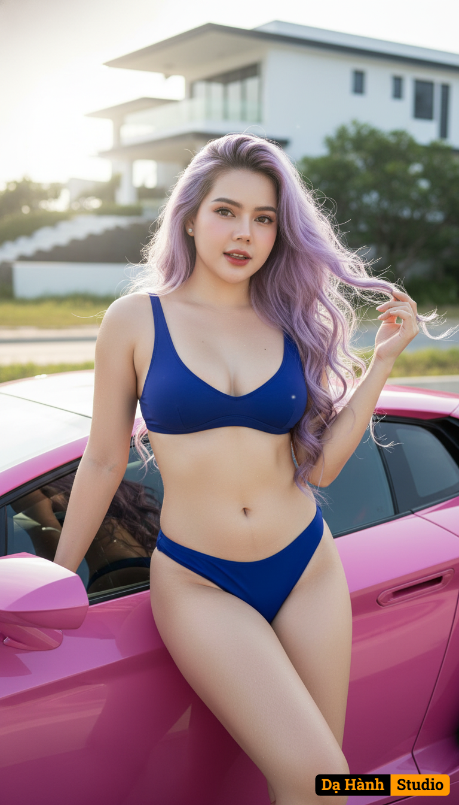

# AI Generated Image

## Details
- **Prompt:** `{
  "name": "Bikini Blue Revision - Lamborghini Pink Edition (Ultra Sensual Realism)",
  "type": "document",
  "content": {
    "source_image": {
      "description": "Prompt-based generation — no uploaded reference image provided.",
      "preserve_identity": true,
      "match_face_100": false,
      "maintain_composition": true,
      "enhancement_goal": "Generate an ultra-photorealistic 8K HDR cinematic image with enhanced sensual appeal, lifelike hair physics, and precise lighting realism."
    },
    "concept": "A hyperrealistic commercial-style image of a confident, sensual Vietnamese woman posing beside a pink Lamborghini supercar under natural daylight — exuding charm, elegance, and premium summer allure. The composition blends high-fashion sensuality with automotive luxury and cinematic realism.",
    "character": {
      "ethnicity": "Vietnamese (Southeast Asian tone)",
      "gender": "female",
      "face": "Delicately photorealistic Vietnamese facial structure with luminous skin, slightly parted glossy lips, subtle blush glow, long lashes, and a warm inviting gaze. Makeup highlights cheekbones and emphasizes sensual femininity without exaggeration.",
      "hair": "Extremely long light-purple wavy hair cascading past the waist, styled in voluminous flowing curls with natural movement and depth. Strands shimmer with multi-tone violet highlights under sunlight, reflecting soft golden light from the car. Fine flyaway strands flow dynamically in the breeze, rendered with cinematic strand-level scattering and wind motion simulation, creating a sense of graceful energy.",
      "body": "Athletic yet feminine with refined curvature — slender waist, toned abdomen, accentuated hips, and long legs. Subtle wet sheen enhances the definition of muscle lines and skin smoothness. Natural posing posture emphasizing sensual poise and confidence.",
      "skin": "Sun-kissed luminous tone with soft natural gradients; micro-water droplets and reflective moisture on collarbones, abdomen, and thighs. Subsurface scattering under HDR light produces lifelike translucency and touchable realism.",
      "expression": "Confident, seductive, and graceful — lips slightly parted as if breathing in the summer air; eyes focused on the viewer with a subtle half-smile blending power and allure.",
      "pose": "Leaning elegantly against the Lamborghini’s fender, one leg subtly crossed in front of the other to accentuate body curves; one hand lifting hair strands in the breeze, the other resting on the car door. Pose designed to project a sense of cinematic sensuality and elegance simultaneously."
    },
    "clothing": {
      "outfit": "Luxury two-piece bikini in deep royal blue (British flag blue), designed with minimal lines and soft contours that emphasize natural body curves. The top has delicate metallic accents reflecting the sunlight, and the fabric clings naturally to the wet skin surface for hyper-realistic texture.",
      "material_detail": "Wet reflective fabric shader with micro-fiber realism; anisotropic highlights under sunlight; natural wrinkle flow conforming to body movement.",
      "style": "Premium swimwear editorial aesthetic — bold yet sophisticated, exuding elegance through subtle sensual expression rather than exposure.",
      "accessories": "No jewelry; optional transparent water bottle on car hood; focus entirely on physique, reflections, and light-skin interaction."
    },
    "setting": {
      "environment": "Luxury coastal road near a modern villa; glossy pink Lamborghini Aventador under warm daylight, surrounded by faint coastal wind movement.",
      "lighting_source": "Natural HDRI sunlight from upper-left (45° angle) with warm reflected fill from the car surface; soft ground bounce illuminating the skin.",
      "details": "Sunlight reflections ripple across wet skin and car paint; hair strands catch rim light; faint cinematic lens flare enhances the premium tone.",
      "atmosphere": "Bright, summery, and sensual — a balance between high-fashion advertising and intimate cinematic realism."
    },
    "lighting": {
      "type": "Natural HDR daylight combined with volumetric light scattering.",
      "direction": "Top-left with secondary bounce from the pink car and bright pavement.",
      "intensity": "Moderate high contrast with cinematic falloff; soft highlight roll-off on skin reflections.",
      "color_temperature": "6450K calibrated for warm tone preservation.",
      "effect": "Skin reflections glimmer naturally; fine rim light accentuates body curvature and hair strands; HDR balance ensures realism without plastic shine."
    },
    "camera": {
      "angle": "Low-angle three-quarter cinematic view emphasizing leg length and car geometry.",
      "lens": "85mm f/1.4 full-frame portrait lens for elegant compression and creamy background bokeh.",
      "depth_of_field": "Shallow DOF; perfect optical separation between model and car background.",
      "focus": "Ultra-sharp focus on face, bikini fabric, and wet highlights; gradual falloff across the car rear.",
      "composition": "Golden-ratio alignment; diagonal car line leads eye toward subject; background softened for cinematic depth.",
      "render_target": "8K HDR tone-mapped output with path-traced reflections and optical fidelity."
    },
    "style": {
      "art_direction": "High-fashion commercial realism with elevated sensual tone — luxurious yet tasteful, designed for premium editorial presentation.",
      "visual_quality": "Physically accurate material rendering, volumetric softness, global illumination with skin translucency and high-fidelity texture mapping.",
      "aesthetic": "Elegant sensuality; focus on realism, beauty, and cinematic intimacy.",
      "tones": "Harmonious contrast between pink car, royal-blue bikini, violet hair, and golden skin — unified under soft daylight."
    },
    "color_palette": {
      "primary": "Royal blue bikini, pink Lamborghini, light-violet hair, golden skin tone.",
      "secondary": "Soft white reflections, faint turquoise sky tint, silver highlights.",
      "mood": "Vibrant, alluring, and cinematic — embodying summer luxury and sensual freedom."
    },
    "technical": {
      "resolution": "8K HDR (7680x4320)",
      "ratio": "16:9 cinematic or 3:2 editorial crop",
      "quality": "Physically Based Rendering (PBR) pipeline with spectral lighting, advanced Fresnel reflection, subsurface scattering, and global illumination.",
      "realism_engine": "Ray-traced optical system with strand-based hair physics, multi-layer skin shading, anisotropic wet-fabric material, and physically calibrated DSLR lens emulation.",
      "exposure_control": "EV 13, ISO 100, f/1.4, 1/250s; dynamic tone mapping to maintain shadow detail and highlight realism.",
      "tone_mapping": "ACEScg color space, 16-bit filmic curve with HDR linear workflow.",
      "render_passes": "Diffuse, Specular, Reflection, Subsurface, Depth, and AO composites merged for ultra-depth realism.",
      "hair_simulation": "Strand-level physics and wind turbulence; multiple scattering and light-response per strand; color dispersion under HDR sunlight.",
      "material_physics": "Measured BRDF data for skin, car paint, and fabric; refractive index calibration for optical realism.",
      "post_process": "Soft bloom 0.2, lens vignette 0.15, chromatic aberration 0.4px, film grain 2.5%, dynamic contrast LUT; gentle warm color curve for cinematic finish."
    },
    "negative": {
      "exclude": "no text, no watermark, no cartoonish effect, no plastic skin, no blur, no distortion, no overexposure, no low-detail surface, no harsh contrast, no artificial lighting artifact."
    },
    "artistic_intent": "To create an ultra-realistic, cinematic-level artwork of a Vietnamese woman beside a pink Lamborghini in royal blue bikini — combining luxury, sensuality, and realism through physically accurate materials, lifelike hair simulation, and optical depth consistent with Dạ Hành Studio’s highest visual standards."
  }
}`
- **Category:** Characters
- **Source Images:**
  - [View Source](https://raw.githubusercontent.com/lenzcomvth/Somethings/main/Models/Female/Female.png)

## Image
