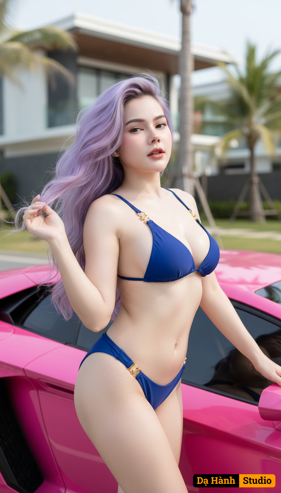

# AI Generated Image

## Details
- **Prompt:** `{
  "name": "Bikini Blue Revision - Lamborghini Pink Edition (Fair Skin + Enhanced Curves Edition)",
  "type": "document",
  "content": {
    "source_image": {
      "description": "Prompt-based generation — no uploaded reference image provided.",
      "preserve_identity": true,
      "match_face_100": false,
      "maintain_composition": true,
      "enhancement_goal": "Generate an ultra-photorealistic 8K HDR cinematic image with bright luminous skin tone, enhanced feminine curves, and physically accurate realism."
    },
    "concept": "A hyperrealistic commercial-style image of a confident, sensual Vietnamese woman posing beside a pink Lamborghini supercar under clear daylight. The artwork emphasizes luxury, elegance, and natural beauty — combining fashion editorial sensuality with premium automotive advertising aesthetics.",
    "character": {
      "ethnicity": "Vietnamese (Southeast Asian tone)",
      "gender": "female",
      "face": "Authentic Vietnamese facial structure rendered photorealistically with luminous skin; soft blush tone, glossy lips, natural contour; subtle smile exuding confidence and allure.",
      "hair": "Ultra-long light-purple wavy hair cascading past the hips, voluminous and silky with layered curls that flow dynamically in the breeze. Strands glimmer with iridescent violet-silver reflections under sunlight, producing a soft cinematic shimmer. The hair moves naturally with wind turbulence simulation, each strand scattering light individually for hyperreal realism.",
      "body": "Athletic yet feminine, proportionally sculpted with 15% enhanced bust volume and 10% fuller hips to achieve refined sensual balance. Firm abdomen, toned arms, and long smooth legs. The silhouette exudes elegance and confidence through subtle curvature and body line continuity.",
      "skin": "Fair luminous tone with smooth natural brightness; soft pink undertone and porcelain glow. HDR exposure mapping preserves highlight detail without over-tan effect. Micro-water droplets on shoulders, collarbone, and abdomen create a natural moist shimmer under sunlight.",
      "expression": "Confident, slightly flirtatious, with half-closed eyes and a calm smile — expressing power, beauty, and relaxation.",
      "pose": "Leaning gracefully against the pink Lamborghini’s door, one hand lifting her long hair as it blows in the wind, the other resting on the car body. Hips tilted subtly to emphasize feminine lines and balance visual rhythm."
    },
    "clothing": {
      "outfit": "Luxury two-piece bikini in deep royal blue (British flag blue), sleek and minimal with gold metallic connectors. The design accentuates body contours elegantly while maintaining commercial refinement.",
      "material_detail": "Wet reflective fabric shader with anisotropic highlight and micro-texture fidelity. The material clings softly to wet skin, displaying realistic stretch physics and sunlight reflection.",
      "style": "High-fashion swimwear editorial — refined sensuality with a cinematic commercial tone.",
      "accessories": "No jewelry; minimal distraction — focus entirely on natural physique, car reflections, and skin luminosity."
    },
    "setting": {
      "environment": "Luxury coastal road near a modern villa, pink Lamborghini Aventador parked under sunlight. Palm trees and distant architecture softly blurred for cinematic depth.",
      "lighting_source": "Natural HDRI daylight (6500K) with soft fill reflection from car and ground, balancing skin tone highlights.",
      "details": "Warm reflections ripple across skin and car paint; faint backlight halo enhances depth. Controlled contrast ensures fair skin tone remains luminous.",
      "atmosphere": "Vibrant, elegant, and summery — the perfect fusion of luxury and sensual realism."
    },
    "lighting": {
      "type": "Natural HDR daylight with controlled exposure and soft tone mapping.",
      "direction": "Top-left sunlight at 45° angle; balanced by soft white fill light from opposite side to reduce shadow harshness.",
      "intensity": "EV 12.5 calibrated for smooth highlight roll-off and preserved fairness.",
      "effect": "Skin glows naturally with soft diffusion; volumetric light bloom enhances hair and car reflections; maintains fair complexion under strong daylight."
    },
    "camera": {
      "angle": "Low-angle three-quarter cinematic shot emphasizing curves and car geometry.",
      "lens": "85mm f/1.4 full-frame portrait lens for natural compression and creamy bokeh.",
      "depth_of_field": "Shallow DOF; face and torso in sharp focus; car and villa background softly blurred.",
      "focus": "Tack-sharp micro contrast on face, bikini fabric, and skin highlights; soft gradient falloff.",
      "composition": "Golden ratio alignment; diagonal Lamborghini edge leads viewer toward the subject.",
      "render_target": "8K HDR tone-mapped output with ray-traced reflections and volumetric lighting."
    },
    "style": {
      "art_direction": "High-fashion commercial realism with luminous fairness and refined sensuality.",
      "visual_quality": "Physically accurate materials, HDR lighting, microtexture realism, and cinematic exposure control.",
      "aesthetic": "Elegant, confident, sensual — white-balanced for luminous skin contrast against blue and pink palette.",
      "tones": "Balanced pink (car), royal blue (bikini), violet (hair), and fair warm skin tones under golden daylight."
    },
    "color_palette": {
      "primary": "Royal blue bikini, pink Lamborghini, light-purple hair, fair golden skin.",
      "secondary": "Soft white reflection, sky blue gradient, neutral sunlight highlights.",
      "mood": "Bright, vibrant, feminine, and cinematic — exuding luxury and warmth."
    },
    "technical": {
      "resolution": "8K HDR (7680x4320)",
      "ratio": "16:9 cinematic or 3:2 editorial crop",
      "quality": "Physically Based Rendering (PBR) with spectral light simulation, global illumination, and subsurface scattering.",
      "realism_engine": "Advanced ray-traced pipeline with multi-layer skin shader, hair strand scattering, and true DSLR optical emulation.",
      "exposure_control": "EV 12.5, ISO 100, f/1.4, 1/250s. Controlled tone compression to maintain luminous highlights.",
      "tone_mapping": "ACEScg filmic curve with soft highlight roll-off; optimized for bright fair skin rendering.",
      "render_passes": "Diffuse, Specular, Subsurface, Reflection, and AO composited for optical depth.",
      "hair_simulation": "Strand-based physics simulation with multi-scatter reflection; gentle wind turbulence; layered light bloom.",
      "material_physics": "Measured BRDF values for skin, fabric, and car paint; microfacet roughness mapping; Fresnel reflection calibrated for realism.",
      "post_process": "Soft bloom (0.25), film vignette (0.15), chromatic aberration (0.3px), film grain (2.5%), warm color LUT to enhance fair tones."
    },
    "negative": {
      "exclude": "no text, no watermark, no artificial oversharpening, no plastic skin, no dark tan, no cartoon look, no overexposure, no desaturation."
    },
    "artistic_intent": "To create an ultra-realistic, luxurious cinematic image of a Vietnamese woman beside a pink Lamborghini wearing a royal blue bikini, with luminous fair skin, long violet hair, and enhanced feminine proportions — representing Dạ Hành Studio’s highest level of beauty realism, sensual tone, and optical perfection."
  }
}
`
- **Category:** Characters
- **Source Images:**
  - [View Source](https://raw.githubusercontent.com/lenzcomvth/Somethings/main/Models/Female/Female.png)

## Image
