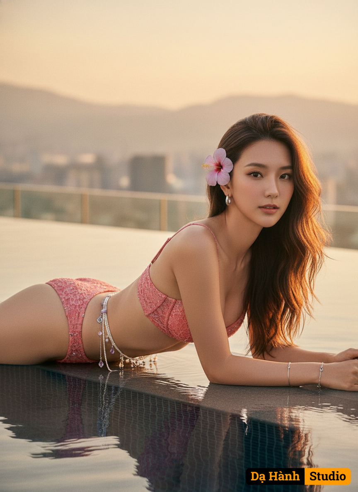

# AI Generated Image

## Details
- **Prompt:** `Create a photorealistic outdoor fashion portrait of a beautiful woman, maintaining 100% of your original face features from the provided image, gracefully lying prone by the edge of a luxurious rooftop infinity pool at golden hour/sunset.
Here's the breakdown:
Overall Style: High quality, photorealistic, outdoor fashion portrait, luxurious and elegant atmosphere, prone pose, dreamy and romantic glow.
Subject: Beautiful  woman
Setting: Luxurious rooftop infinity pool at golden hour/sunset. Background features a breathtaking cityscape and distant mountains under a warm, soft sunset sky with golden and orange hues. Pool water reflects the beautiful sunset colors.
Appearance: Long wavy brown hair.
Pose: Gracefully lying prone (on her stomach) by the edge of the pool, propped up slightly by her elbows. Looking directly at the camera with a captivating gaze. Body is positioned in a relaxed yet prone pose, with her elbows gently supporting her upper body. One leg is slightly bent at the knee, creating an elegant line.
Attire: Stunning two-piece pastel red bikini set. Bikini top features a textured fabric or delicate lace with subtle silver accents. Matching style bikini bottom
Accessories: Delicate pastel purple hibiscus flower tucked behind one ear. Multiple layers of delicate silver chains and small pearl strands around her waist, with tiny amethyst or clear crystal charms. Silver hoop earrings. Delicate silver bracelet.
Lighting: Soft and warm, creating a dreamy and romantic glow on her skin and the intricate details of her outfit.
The goal is to create a visually stunning and captivating image that captures a sense of beauty, luxury, and sophisticated style while accurately portraying your unique features and the specified details.`
- **Category:** Characters
- **Source Images:**
  - [View Source](https://raw.githubusercontent.com/lenzcomvth/Somethings/main/Models/Female/Female3.jpg)

## Image
