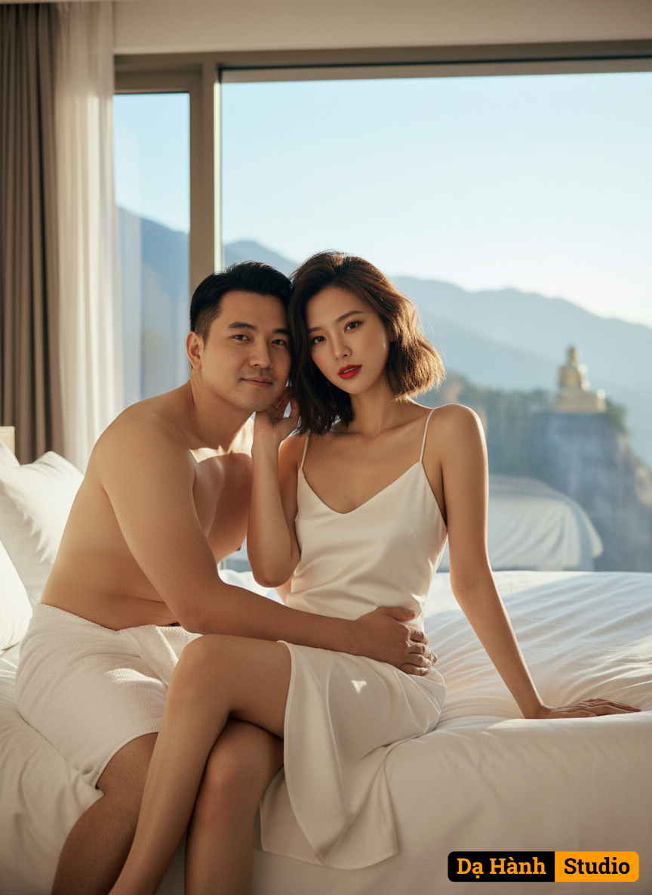

# AI Generated Image

## Details
- **Prompt:** `Upload the original facial images of both the male and female subjects, and the outfit image for the female (Image 2).
🎨 Image Details (Ultra-Photorealistic 8K HDR)
Scene:
A cozy bedroom in the evening atmosphere, featuring a soft white bed and warm orange lamp lighting from the walls and ceiling. The mood is romantic and relaxing. A small wooden chair and table sit beside the bed, and a potted plant near the doorway adds a touch of freshness and natural charm.
👩 Female Subject
Use the real face from the original image 100% (no facial structure changes).
Attractive body, fair skin.
Bright red lips.
Short hair as in the reference image, with loose strands softly framing her cheeks.
Wearing a modest, elegant white satin dress suitable for an indoor setting, accentuating her curves, especially the hips.
Makeup in Douyin Girl style (natural, clear Chinese beauty look).
👨 Male Subject
Use the real face from the original image 100% (no facial structure changes).
Shirtless, wearing only a towel wrapped around the waist.
Slightly chubby and proportionate body build.
💞 Pose & Emotion
💑 Pose Details:
The woman sits on the bed with one leg folded up and the other slightly bent.
Her right hand rests on the bed for balance, while her left hand lifts to touch her hair near the head, creating a relaxed yet alluring posture.
Her torso leans back slightly, emphasizing her waist and chest curves.
Her head tilts gently, eyes looking directly at the camera with a confident and charming gaze.
The overall expression conveys intimacy and warmth between the lovers.
The woman’s eyes show confidence and sensuality, while the man’s expression shows pride and deep affection.
The man sits behind the woman, gently wrapping his arms around her waist or shoulders in a warm embrace, head leaning near her cheek, gazing warmly at the camera.
🛏️ Setting:
Inside a luxurious minimalist hotel room with a king-size bed draped in crisp white sheets and neatly arranged soft pillows.
Behind them, a large glass wall reveals a scenic mountain view with a golden Buddha statue on a cliff, symbolizing a peaceful and spiritual retreat.
☀️ Mood & Lighting:
The tone captures the freshness of a new morning. Natural light streams through the glass, creating a warm and soothing atmosphere.
Soft shadows fall across the bed and the couple’s hair, enhancing the tenderness of the moment.
The overall mood radiates warmth and love as the couple shares a calm morning together.
🎞️ Color & Atmosphere:
A soft palette of white, sky blue, and golden hues, highlighting the brightness of morning light and the warmth of love.
Rendered in 8K HDR ultra-realistic detail, with smooth, natural lighting and depth similar to a 50 mm f/1.8 lens photo—like a luxury resort advertisement infused with romance and happiness.
💗 Emotional Tone:
The pose conveys sensuality, confidence, and charm—ideal for a warm-tone indoor fashion or intimate romantic photo style.
📸 Camera Angle & Composition:
Eye-level medium wide shot, showing both subjects clearly on the bed with the scenic background visible behind them.`
- **Category:** Characters
- **Source Images:**
  - [View Source](https://raw.githubusercontent.com/lenzcomvth/Somethings/main/Models/Female/Female3.jpg)

## Image
