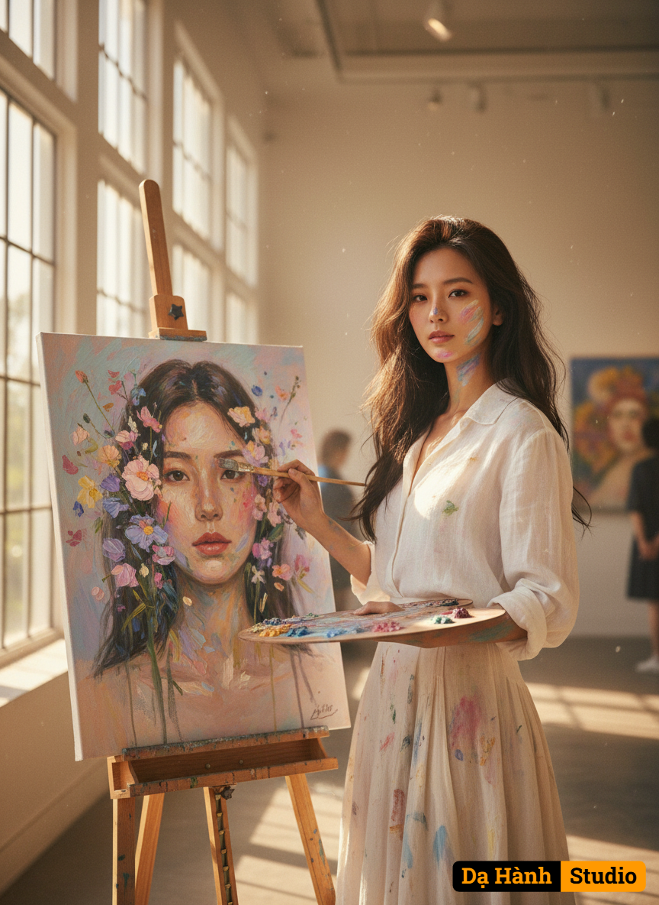

# AI Generated Image

## Details
- **Prompt:** `Changing the style of the uploaded subject and keeping the same face, standing in a bright art gallery, paintbrush and tray of multi-colored oil paints in hand, standing next to a colorful oil portrait easel close-up is the face of the uploaded subject and a wildflower. The painting is expressive, with thick brush strokes and pastel tones of pink, lavender, blue and cream, giving it a dreamy impressionistic style. Sunlight pours through the large windows, casting a warm and soft light throughout the room, wearing a simple white blouse and a light-colored skirt, paint stains on the face, body and shirt, hair slightly messy naturally. The atmosphere gives a sense of peace, art and intimacy, highlighting both the artist and the artwork on the subject's face in a cinematic composition.`
- **Category:** Characters
- **Source Images:**
  - [View Source](https://raw.githubusercontent.com/lenzcomvth/Somethings/main/Models/Female/Female3.jpg)

## Image
