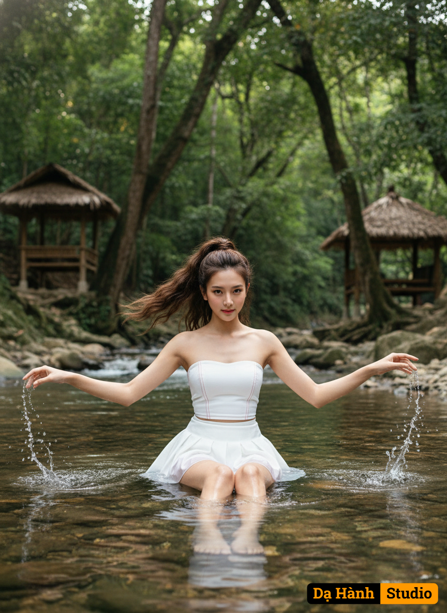

# AI Generated Image

## Details
- **Prompt:** `สร้างภาพพอร์ตเทรตสมจริง(ใบหน้าเหมือน100%ห้ามแก้ไข)

รายละเอียดกล้อง:ใช้กล้อง Canon E0S R5เลนส RF
85mm f/1.2Lฟลเฟรมรูรับแสง f/1.4ความละเอียดสูงสุด
8Kให้ความคมชัดสมจริงระดับมืออาชีพ

สวมเสื้อเกาะอกสีขาว ตะเข็บสีแดงและกระโปรงสั้นเป็นกรีบ บานๆเธอมีผมยาวน้ำตาลผูกยกสูงหางม้าลอนใหญ่แต่งหน้าโทนชมพูแดง เน้นความเป็นธรรมชาติ

ผู้หญิงคนนี้นั่งอยู่กลางลำธาร/แม่น้ำตื้น ๆ โดยระดับน้ำอยู่ประมาณช่วงต้นขาหรือเอวเล็กน้อย เธอกางแขนออกทั้งสองข้าง มือสัมผัสกับผิวน้ำ ทำให้เห็นน้ำกระเซ็นเล็กน้อย

* ฉากหลัง/สถานที่: เป็นฉากหลังที่เป็นธรรมชาติ คาดว่าเป็นสถานที่ท่องเที่ยวที่มีลำธารหรือน้ำตก
* ด้านหน้า/ล่าง: มีลำธารที่มีน้ำใสไหลผ่าน เห็นก้อนหินอยู่ใต้น้ำ
* ด้านข้างและด้านหลัง: เป็นป่าไม้เขียวครึ้ม มีต้นไม้ใหญ่หนาแน่น เห็นพุ่มไม้และใบไม้มากมาย
* สิ่งก่อสร้าง: บริเวณด้านซ้ายและขวาของภาพด้านหลัง มีการสร้างที่พักหรือซุ้ม/ศาลาขนาดเล็ก มีโครงสร้างไม้และหลังคามุงจากหรือวัสดุธรรมชาติ ซึ่งเป็นลักษณะที่พบได้ตามร้านอาหารริมน้ำหรือที่พักในบริเวณลำธาร `
- **Category:** Nhân vật
- **Source Images:**
  - [View Source](https://raw.githubusercontent.com/lenzcomvth/Somethings/main/Models/Female/Female3.jpg)

## Image
