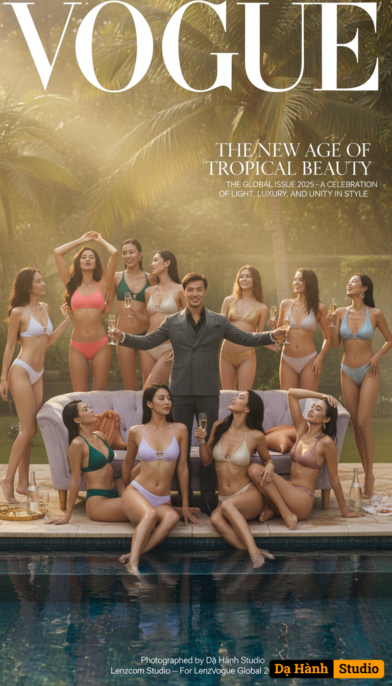

# AI Generated Image

## Details
- **Prompt:** `Ultra-photorealistic cinematic fashion editorial, 8K resolution, 4:3 aspect ratio, styled as a VOGUE 2025 Global Issue cover. The image blends tropical luxury, body symmetry, and cinematic storytelling — evoking timeless elegance, sensual grace, and modern power. 👤 Main Male Subject (Centerpiece): Use the uploaded man’s real face exactly as in the reference photo — no alteration, 100% fidelity. He stands with arms outstretched in an inviting, charismatic gesture on the luxurious light-lavender velvet sofa, positioned beside a tropical pool framed by lush palms and sunlit mist. His posture is cinematic and dynamic: Looking directly at the camera with an open, welcoming smile, a champagne glass in one hand. Gaze: inviting, charismatic, magnetic — like a modern icon in the world of fashion. 👠 Surrounding Female Supermodels (Full Ensemble, 10+): A luxury constellation of international supermodels, flowing around him in a graceful semicircle, some walking towards him, others striking powerful, dynamic poses, creating a strong sense of movement and interaction — each figure adding rhythm and story. All women are posed in fluid, intertwined positions — some reclining slightly backward with arched torsos and crossed legs, others leaning in elegantly — creating sensual curves and movement. Their skin glows with natural shimmer, wet highlights, and perfect posture. 🇻🇳 Vietnamese model (99% Phí Huyền Trang) — coral-pink bikini, head tilted back, hair cascading, champagne glass in hand. 🇯🇵 Japanese model (99% Eimi Fukada) — lavender-white bikini, leaning gracefully toward the man, eyes soft, hand resting near his arm. 🇺🇸 American model (99% Megan Fox) — gold bikini, body angled toward camera, one hand brushing his shoulder, seductive confidence. 🇵🇭 Filipina model — emerald bikini, sitting closer to the pool edge, reflection glistening on skin. 🇰🇷 Korean model — silver-gray bikini, minimalistic and statuesque, body arched backward elegantly. 🇹🇭 Thai model — deep green bikini, hand raised through her hair, light and shadow playing across her curves. 🇧🇷 Brazilian model — white-gold bikini, curvy silhouette catching sun rays. 🇫🇷 French model — soft-rose satin bikini, pearl accessories, reclining back on one elbow, gazing up with confidence. 🇪🇺 European model — icy-blue bikini, dreamy expression, soft wet skin tone. 🌍 Additional international models fill the background with depth and motion — laughing, toasting champagne, or turning toward sunlight. 💫 Symmetrical Models Beneath the Sofa: Two supermodels with sculpted physiques stand tall and elegant symmetrically on both sides below the sofa, mirroring his outstretched arms in a powerful, welcoming stance, looking directly into the lens with powerful allure. Their bodies gleam with water reflections and rim-lit by sunlight; their posture evokes movement, life, and perfection. 🌴 Environment & Atmosphere: Setting: an open-air tropical terrace with a luxury pool. Palm leaves frame the scene, light mist dances over the water. Lighting: golden-hour sunlight filtered through foliage — warm, glowing, natural, layered. Water reflections: soft blue and gold tones shimmering across the skin and marble tiles. Air: hazy, humid, cinematic; faint bokeh from background foliage. Depth: the shot captures foreground reflection, mid-ground subjects, and blurred background palms, producing rich spatial layering. Decor: glass bottles, golden trays, silk fabrics, champagne splashes — subtly reinforcing luxury lifestyle energy. 🎨 Artistic Color & Mood: Primary palette: lavender haze, tropical emerald, champagne gold, coral pink, ocean teal, warm bronze. Tone: cinematic golden-hour warmth blended with pastel overtones — modern yet timeless. Style: high-contrast rim light and volumetric depth; glowing mist outlines contours. Feeling: sensual, elegant, bold, elite — the moment between indulgence and serenity. 🩵 VOGUE Typography & Headline Layout (2025 Edition): Logo Placement: Large “VOGUE” text spans the top border, serif typeface (Didot or Bodoni), colored white with subtle golden reflection. Slight shadow for contrast against tropical background. Main Headline (Center-right, overlaying foliage): THE NEW AGE OF TROPICAL BEAUTY (Golden serif with soft lavender drop shadow) Subheadline (below main): THE GLOBAL ISSUE 2025 — A CELEBRATION OF LIGHT, LUXURY, AND UNITY IN STYLE Side Headlines (in small modern sans-serif): “Sunlight & Silk: The Future of Fashion Realism” “Asia Meets the World: The New Supermodel Era” “Behind the Glass — The Rise of Cinematic Fashion” Footer Tagline (bottom center): Photographed by Dạ Hành Studio — For Lenzcom Vogue Global 2025 Typography is layered subtly over the image without obscuring faces; text curves gently around the sofa line, mimicking real magazine print design. 📸 Camera & Lighting Setup: Hasselblad H6D or Sony α7R V — 35mm f/1.8, ISO 100, shutter 1/250s. Dynamic action shot, slightly wide, capturing movement and interaction from an eye-level perspective. Lighting: soft frontal fill + rim backlight from left 45°, golden-hour tone 5400K. Water bounce reflection for organic shimmer. Slight haze, volumetric rays, bokeh leaves. Shallow DOF, cinematic grade depth, 3D realism. 🔑 Keywords for AI: ultra-photorealistic, cinematic lighting, 8K fashion editorial, Vogue magazine cover, tropical poolside, global supermodels, purple velvet sofa, champagne glass, golden-hour sunlight, lush greenery, Phí Huyền Trang lookalike, Eimi Fukada lookalike, Megan Fox lookalike, Filipina, Korean, Thai, Brazilian, French, European models, dynamic posing, crossed legs, reflective water, glowing skin, cinematic depth, luxury lifestyle, typography layout, The New Age of Tropical Beauty, Vogue Global Issue 2025.`
- **Category:** Nhân vật
- **Source Images:**
  - [View Source](https://raw.githubusercontent.com/lenzcomvth/Somethings/main/Models/Male/Male.png)

## Image
